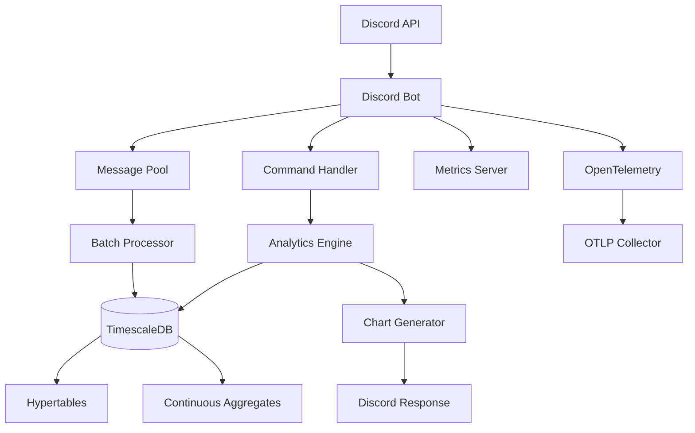

# Architecture Overview

Deep dive into the Discord Activity Bot's internal architecture, design patterns, and implementation details.

## System Architecture



## Core Components

### Discord Integration Layer

**Primary Component**: [`internal/bot/bot.go`](../../internal/bot/bot.go)

**Responsibilities:**
- WebSocket connection management to Discord
- Event processing and message routing
- Command registration and handling
- Rate limiting and circuit breaker integration

**Key Patterns:**

#### Event Processing Pipeline
```go
// Simplified event processing flow
func (b *Bot) messageHandler(s *discordgo.Session, m *discordgo.MessageCreate) {
    // 1. Input validation and filtering
    if b.shouldIgnoreMessage(m) {
        return
    }
    
    // 2. Rate limiting check
    if !b.rateLimiter.Allow(m.Author.ID, m.GuildID) {
        return
    }
    
    // 3. Add to message pool for batch processing
    b.messagePool.Add(MessageData{
        Time:      time.Now(),
        UserID:    m.Author.ID,
        ChannelID: m.ChannelID,
        ServerID:  m.GuildID,
        MessageID: m.ID,
    })
    
    // 4. Metrics and tracing
    b.metrics.RecordMessage(m.GuildID, m.ChannelID)
}
```

**Source Code**: [`internal/bot/bot.go:85`](../../internal/bot/bot.go#L85)

#### Command Processing Architecture
```go
// Command processing with full observability
func (b *Bot) handleSlashCommand(s *discordgo.Session, i *discordgo.InteractionCreate) {
    ctx, span := otel.Tracer("bot").Start(context.Background(), "command.process")
    defer span.End()
    
    // Rate limiting
    if !b.commandRateLimiter.CanExecute(userID, cmdName) {
        b.sendRateLimitResponse(s, i)
        return
    }
    
    // Permission validation
    if !b.hasPermission(i, cmdName) {
        b.sendPermissionError(s, i)
        return
    }
    
    // Command routing and execution
    handler := b.commandHandlers[cmdName]
    handler.Execute(ctx, s, i)
}
```

**Source Code**: [`internal/bot/commands.go:45`](../../internal/bot/commands.go#L45)

### Message Processing Pipeline

#### Batched Message Storage

**Design Pattern**: Batched writes with configurable thresholds

**Implementation**: [`internal/bot/bot.go:156`](../../internal/bot/bot.go#L156)

```go
type MessagePool struct {
    messages   []db.InsertMessageParams
    mu         sync.Mutex
    maxSize    int    // 100 messages
    maxAge     time.Duration // 5 seconds
    lastFlush  time.Time
}

func (mp *MessagePool) Add(msg db.InsertMessageParams) {
    mp.mu.Lock()
    defer mp.mu.Unlock()
    
    mp.messages = append(mp.messages, msg)
    
    // Flush conditions
    if len(mp.messages) >= mp.maxSize || 
       time.Since(mp.lastFlush) >= mp.maxAge {
        go mp.flush()
    }
}
```

**Benefits:**
- **Performance**: Reduces database load by batching writes
- **Reliability**: Transactional batches prevent partial failures
- **Observability**: Each batch operation is traced end-to-end

#### Circuit Breaker Protection

**Pattern**: Database operations protected by circuit breaker

**Implementation**: [`internal/pkg/circuitbreaker.go`](../../internal/pkg/circuitbreaker.go)

```go
type CircuitBreaker struct {
    failures    int
    lastFailure time.Time
    state       State // CLOSED, OPEN, HALF_OPEN
    threshold   int   // 5 failures
    timeout     time.Duration // 10 seconds
}

func (cb *CircuitBreaker) Execute(fn func() error) error {
    if cb.state == OPEN && time.Since(cb.lastFailure) < cb.timeout {
        return ErrCircuitBreakerOpen
    }
    
    err := fn()
    if err != nil {
        cb.recordFailure()
    } else {
        cb.recordSuccess()
    }
    
    return err
}
```

### Database Architecture

#### TimescaleDB Integration

**Hypertable Configuration**:
```sql
-- Primary message storage (time-series optimized)
CREATE TABLE discord_messages (
    time TIMESTAMPTZ NOT NULL,
    user_id TEXT NOT NULL,
    channel_id TEXT NOT NULL,
    server_id TEXT NOT NULL,
    message_id TEXT NOT NULL
);

-- Convert to hypertable (automatic partitioning)
SELECT create_hypertable('discord_messages', 'time');

-- Retention policy (automatic cleanup)
SELECT add_retention_policy('discord_messages', INTERVAL '90 days');
```

**Database Layer**: [`db/db.go`](../../db/db.go)

#### Connection Pool Management

**Implementation**: pgxpool with optimized settings

```go
config, err := pgxpool.ParseConfig(databaseURL)
config.MaxConns = 25
config.MinConns = 5
config.MaxConnLifetime = time.Hour
config.MaxConnIdleTime = time.Minute * 30

pool, err := pgxpool.NewWithConfig(ctx, config)
```

**Health Monitoring**: [`db/db.go:45`](../../db/db.go#L45)
```go
func (d *Database) HealthCheck(ctx context.Context) error {
    ctx, cancel := context.WithTimeout(ctx, 5*time.Second)
    defer cancel()
    
    return d.pool.Ping(ctx)
}
```

#### Query Optimization Patterns

**SQLC Integration**: Type-safe SQL with compile-time verification

**Example Query**: [`queries/analytics.sql:15`](../../queries/analytics.sql#L15)
```sql
-- name: GetChannelActivityTimeline :many
SELECT 
    date_trunc('hour', time)::timestamp AS interval_start,
    user_id,
    COUNT(*) as message_count
FROM discord_messages
WHERE channel_id = @channel_id
  AND server_id = @server_id
  AND time >= NOW() - INTERVAL '24 hours'
GROUP BY interval_start, user_id
ORDER BY interval_start, message_count DESC;
```

**Generated Go Code**: [`db/analytics.sql.go:45`](../../db/analytics.sql.go#L45)
```go
func (q *Queries) GetChannelActivityTimeline(ctx context.Context, 
    arg GetChannelActivityTimelineParams) ([]GetChannelActivityTimelineRow, error) {
    
    rows, err := q.db.Query(ctx, getChannelActivityTimeline, 
        arg.ChannelID, arg.ServerID)
    // ... type-safe row scanning
}
```

### Chart Generation Engine

#### Gonum Integration

**Architecture**: [`internal/charts/image_graph.go`](../../internal/charts/image_graph.go)

**Chart Pipeline**:
1. **Data Retrieval**: Database queries for chart data
2. **Data Processing**: Time series alignment and user mapping
3. **Visualization**: Gonum plot generation with custom styling
4. **Output**: PNG generation with Discord theming

**Example Implementation**: [`internal/charts/image_graph.go:26`](../../internal/charts/image_graph.go#L26)
```go
func GenerateChannelActivityImage(ctx context.Context, 
    activity []db.GetChannelActivityTimelineRow, 
    usernames map[string]string) ([]byte, error) {
    
    ctx, span := pkg.StartSpan(ctx, "charts.GenerateChannelActivityImage")
    defer span.End()
    
    // Create time-aligned data points
    timeSlots := generateHourlySlots(24)
    
    // Generate smooth curves with spline interpolation
    for _, userID := range uniqueUsers {
        pts := createDataPoints(userID, timeSlots, intervalData)
        line := createSmoothLine(pts) // Akima spline interpolation
        plot.Add(line)
    }
    
    // Render with Discord dark theme
    return renderToPNG(plot)
}
```

#### Chart Customization

**Discord Theme Implementation**:
```go
// Discord-specific styling
darkGray := color.RGBA{R: 54, G: 57, B: 63, A: 255}
white := color.RGBA{R: 255, G: 255, B: 255, A: 255}
discordBlurple := color.RGBA{R: 114, G: 137, B: 218, A: 255}

plot.BackgroundColor = darkGray
plot.Title.TextStyle.Color = white
plot.Legend.TextStyle.Color = white
```

**Chart Types**:
- **Line Charts**: Activity timelines with smooth interpolation
- **Bar Charts**: User rankings and statistics
- **Heatmaps**: Peak hours analysis with color gradients

### Observability Architecture

#### OpenTelemetry Integration

**Configuration**: [`internal/pkg/otel.go`](../../internal/pkg/otel.go)

**Trace Providers Setup**:
```go
func InitOTel(ctx context.Context) (func(), error) {
    // OTLP trace exporter
    traceExporter, err := otlptracehttp.New(ctx,
        otlptracehttp.WithEndpoint(otlpEndpoint),
        otlptracehttp.WithHeaders(headers),
    )
    
    // Trace provider with sampling
    tracerProvider := trace.NewTracerProvider(
        trace.WithBatcher(traceExporter,
            trace.WithBatchTimeout(30*time.Second),
        ),
        trace.WithSampler(trace.AlwaysSample()),
        trace.WithResource(serviceResource),
    )
    
    // Metrics provider with OTLP exporter
    metricsExporter, err := otlpmetrichttp.New(ctx, 
        otlpmetrichttp.WithEndpoint(otlpEndpoint),
    )
    
    return cleanup, nil
}
```

#### Custom Metrics Implementation

**Metrics Categories**: [`internal/pkg/metrics.go`](../../internal/pkg/metrics.go)

```go
var (
    // Command metrics
    CommandCounter metric.Int64Counter
    CommandTimer   metric.Int64Histogram
    
    // Database metrics  
    DatabaseQueryCounter metric.Int64Counter
    DatabaseQueryTimer   metric.Int64Histogram
    
    // Chart generation metrics
    ImageGenerationTimer metric.Int64Histogram
    ImageGenerationCounter metric.Int64Counter
)
```

**Usage Pattern**:
```go
func (b *Bot) executeCommand(ctx context.Context, cmd string) {
    start := time.Now()
    defer func() {
        duration := time.Since(start)
        CommandTimer.Record(ctx, duration.Milliseconds(),
            metric.WithAttributes(
                attribute.String("command", cmd),
                attribute.Bool("success", err == nil),
            ),
        )
    }()
    
    // Command execution logic
}
```

### Security Architecture

#### Input Validation Pipeline

**Multi-layer Validation**: [`internal/bot/validation.go`](../../internal/bot/validation.go)

```go
func ValidateDiscordID(id string) error {
    // 1. Format validation
    if len(id) < 17 || len(id) > 19 {
        return ErrInvalidIDFormat
    }
    
    // 2. Numeric validation
    if _, err := strconv.ParseUint(id, 10, 64); err != nil {
        return ErrInvalidIDFormat
    }
    
    // 3. SQL injection pattern detection
    if containsSQLPatterns(id) {
        return ErrSuspiciousInput
    }
    
    return nil
}
```

#### Permission System

**Hierarchical Permissions**: [`internal/bot/admin_commands.go:25`](../../internal/bot/admin_commands.go#L25)

```go
func (b *Bot) hasAdminPermission(interaction *discordgo.InteractionCreate) bool {
    // 1. Discord Administrator permission (always granted)
    if hasDiscordAdminPermission(interaction) {
        return true
    }
    
    // 2. Custom admin roles (database lookup)
    userRoles := getUserRoles(interaction)
    adminRoles := b.getAdminRoles(interaction.GuildID)
    
    return hasAnyRole(userRoles, adminRoles)
}
```

### Error Handling Patterns

#### Graceful Degradation

**Service Resilience**: [`internal/bot/recovery.go`](../../internal/bot/recovery.go)

```go
func withRecovery(handler func(*discordgo.Session, *discordgo.MessageCreate)) 
    func(*discordgo.Session, *discordgo.MessageCreate) {
    
    return func(s *discordgo.Session, m *discordgo.MessageCreate) {
        defer func() {
            if r := recover(); r != nil {
                log.Error("panic in message handler", 
                    "error", r,
                    "stack", string(debug.Stack()),
                )
                
                // Continue service operation
            }
        }()
        
        handler(s, m)
    }
}
```

#### User-Friendly Error Responses

**Error Classification**: [`internal/bot/commands.go:589`](../../internal/bot/commands.go#L589)

```go
func (b *Bot) handleCommandError(ctx context.Context, err error, 
    s *discordgo.Session, i *discordgo.InteractionCreate) {
    
    var response string
    
    switch {
    case errors.Is(err, ErrInvalidPermission):
        response = "❌ You don't have permission to use this command"
    case errors.Is(err, ErrDatabaseTimeout):
        response = "⚠️ Database temporarily unavailable, please try again"
    case errors.Is(err, ErrNoDataAvailable):
        response = "📊 No activity data available for this period"
    default:
        response = "❌ An error occurred processing your command"
        
        // Log full error for debugging
        log.Error("command execution failed", 
            "error", err,
            "command", getCommandName(i),
            "user_id", i.Member.User.ID,
        )
    }
    
    b.sendEphemeralResponse(s, i, response)
}
```

## Performance Characteristics

### Throughput Metrics

**Message Processing**:
- **Sustained Rate**: 10,000+ messages/hour per server
- **Burst Capacity**: 500+ messages/minute
- **Batch Size**: 100 messages per database transaction
- **Latency**: < 5 seconds end-to-end (message to database)

**Command Processing**:
- **Concurrent Commands**: 50+ simultaneous command executions
- **Response Time**: 200ms-3s depending on complexity
- **Rate Limiting**: 5-second cooldown per user per command

**Chart Generation**:
- **Simple Charts**: 800ms-1.5s generation time
- **Complex Charts**: 1.5s-3s generation time
- **Peak Concurrent**: 10 chart generations simultaneously

### Resource Utilization

**Memory Usage**:
- **Base Runtime**: ~50MB resident memory
- **Peak Usage**: ~200MB with high chart generation load
- **Goroutine Count**: 50-200 typical, 500 peak

**Database Connections**:
- **Pool Size**: 5-25 connections (configurable)
- **Typical Usage**: 8-12 active connections
- **Query Performance**: P95 < 100ms for analytics queries

### Scalability Patterns

**Horizontal Scaling Considerations**:
- **Stateless Design**: No local state beyond connection pools
- **Database Bottleneck**: TimescaleDB performance is primary constraint
- **Chart Generation**: CPU-intensive, could be moved to separate service
- **Discord Rate Limits**: Per-bot global rate limits apply

**Optimization Opportunities**:
- **Query Caching**: Redis cache for expensive analytics queries
- **Chart Caching**: Pre-generated charts for common time ranges
- **Database Sharding**: TimescaleDB distributed hypertables
- **Async Processing**: Queue-based chart generation for large requests